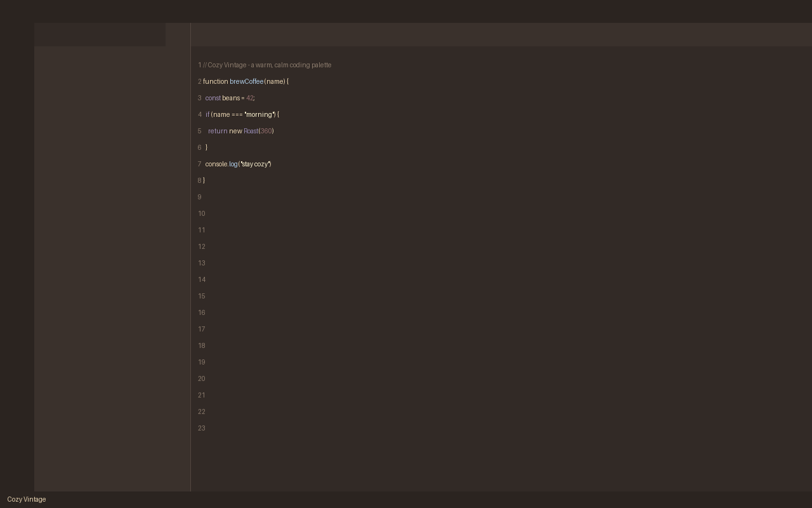
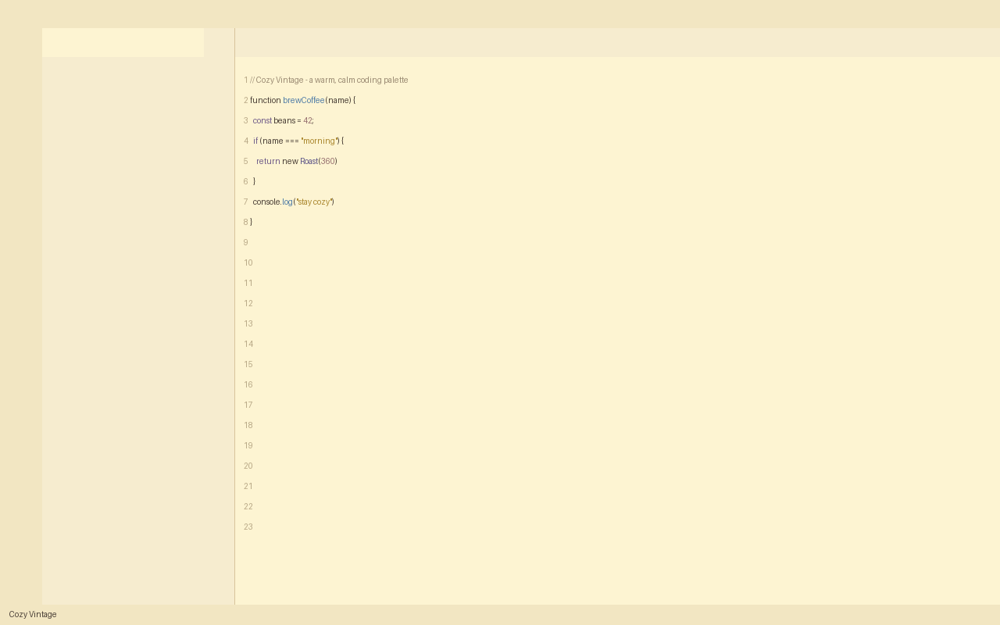

<p align="center">
  
</p>

<h1 align="center">Cozy Vintage Theme</h1>

<p align="center">
  A warm, low-saturation vintage-inspired VS Code theme with cozy dark and light variants for calm, comfortable coding.
</p>

<p align="center">
  <a href="https://marketplace.visualstudio.com/items?itemName=lilinhuang.cozy-vintage-theme">
    
  </a>
</p>

## Features

Cozy Vintage brings a soft retro palette to your editor. Two carefully tuned variants are included:

- **Cozy Vintage Dark** — a deep warm brown and muted charcoal background that feels like coding in a cozy vintage room at night. No pure black, no neon, no harsh contrast.
- **Cozy Vintage Light** — a warm cream editor background that feels like coding on vintage paper in warm morning sunlight. No pure white, no glaring contrast.

The syntax palette is shared across both variants for a consistent feel:

- Keywords — muted lavender
- Functions — dusty blue
- Strings — warm cream / soft golden
- Variables — soft brown-gray
- Numbers & constants — vintage rose brown
- Classes & types — blue-purple
- Comments — low-contrast warm gray-brown

## Color Palette

| Role | Color | Hex |
| --- | --- | --- |
| Butter Cream | `#FDF4D2` | warm paper |
| Dusty Blue | `#B0CDE6` | functions, accents |
| Muted Lavender | `#A290B7` | keywords |
| Vintage Rose Brown | `#946D6D` | numbers, badges |

## Screenshots

<p align="center">
  
</p>

<p align="center">
  <em>Cozy Vintage Dark — deep warm brown editor with muted lavender, dusty blue and vintage rose syntax.</em>
</p>

<p align="center">
  
</p>

<p align="center">
  <em>Cozy Vintage Light — warm cream editor background that feels like coding on vintage paper.</em>
</p>

## Installation

1. Open the Extensions view in VS Code (`Ctrl+Shift+X`).
2. Search for `Cozy Vintage`.
3. Click **Install**.

Or install from the command line:

```bash
code --install-extension cozy-vintage-theme-1.0.0.vsix
```

## Activation

1. Open the Command Palette (`Ctrl+Shift+P`).
2. Run **Preferences: Color Theme**.
3. Select **Cozy Vintage Dark** or **Cozy Vintage Light**.

## Feedback

Found a color that hurts your eyes or want a new variant? Open an issue on the project repository.

## License

Non-Commercial License. Free for personal, non-commercial use. See `LICENSE.md` for details.
