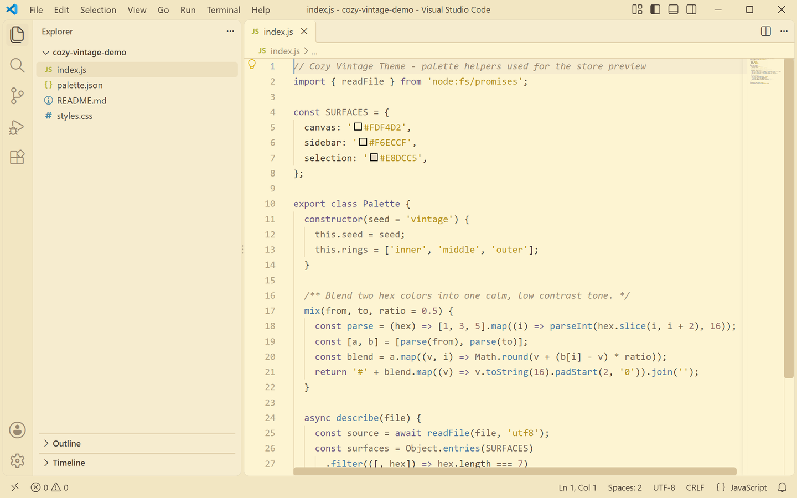
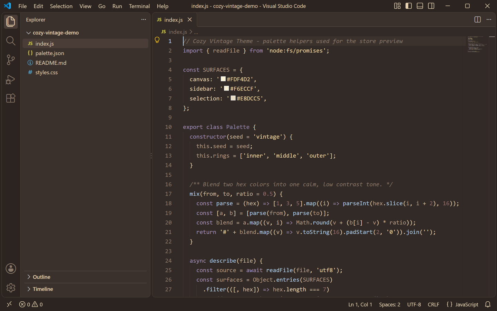

<p align="center">
  
</p>

<h1 align="center">Cozy Vintage Theme</h1>

<p align="center">
  A warm, low-saturation vintage VS Code theme with coordinated dark and light variants for calm, comfortable coding.
</p>

<p align="center">
  <a href="https://marketplace.visualstudio.com/items?itemName=lilinhuang.cozy-vintage-theme">
    
  </a>
  <a href="https://github.com/vaxicy/cozy-vintage-theme/blob/main/LICENSE">
    
  </a>
</p>

## Previews

<p align="center">
  
  
</p>

Left is the light variant, right is the dark variant. Both were captured in
Visual Studio Code with the extension installed, using the same JavaScript file
and the same window layout.

## Introduction

Cozy Vintage Theme is a quiet, warm color theme for Visual Studio Code. It keeps
contrast soft and colors low-saturation: no pure black, no pure white, no neon.
The result feels like coding in a cozy vintage study — deep cocoa and roasted
brown at night, butter-cream paper in daylight.

The extension ships two selectable variants from one visual family:

- **Cozy Vintage Dark** — a deep warm brown canvas (`#322A26`) with cream text and muted lavender, dusty blue and vintage rose syntax.
- **Cozy Vintage Light** — a warm cream canvas (`#FDF4D2`) that feels like coding on vintage paper, with the same syntax palette deepened for readability in daylight.

## Palette

| Role | Light | Dark | Name |
| --- | --- | --- | --- |
| Editor canvas | `#FDF4D2` | `#322A26` | butter cream / deep cocoa |
| Side bar | `#F6ECCF` | `#3A312C` | warm linen / cocoa shade |
| Tabs & panels | `#F2E6C2` | `#2B2420` | toasted parchment / dark roast |
| Selection | `#E4D2B0` | `#5A4642` | raw silk / espresso |
| Accent | `#7C9FBE` | `#B0CDE6` | dusty blue |
| Foreground | `#4A3F36` | `#E7D3B1` | dark walnut / warm cream |

## Syntax

Comments stay quiet and italic (`#9A8A72` / `#8A7A6B`), keywords, tags and
headings carry muted lavender (`#6E5A88` / `#A290B7`), functions sit in dusty
blue (`#4E7BA6` / `#B0CDE6`), strings use a soft gold (`#B8941F` / `#F2D9A0`),
numbers and constants a vintage rose brown (`#946D6D` in both variants), and
types and classes a soft violet (`#5B5387` / `#9488B0`).

## Installation

1. Open the Extensions view (`Ctrl+Shift+X` / `Cmd+Shift+X`).
2. Search for `Cozy Vintage Theme`.
3. Click **Install**.

Or install from the command line:

```
code --install-extension lilinhuang.cozy-vintage-theme
```

## Usage

1. Open the Command Palette (`Ctrl+Shift+P` / `Cmd+Shift+P`).
2. Run **Preferences: Color Theme** (or `Ctrl+K Ctrl+T`).
3. Pick **Cozy Vintage Dark** or **Cozy Vintage Light**.

## Notes

- Both variants theme the whole workbench, not only the editor: activity bar,
  side bar, tabs, panels, terminal, lists, inputs, dropdowns, menus, badges,
  editor widgets and Git decorations.
- The README previews come from real VS Code windows captured with the
  extension installed, so what you see is what the theme renders.
- See the [changelog](CHANGELOG.md) for release notes.

## Feedback

Found a color that hurts your eyes, or want a new variant? Open an issue or
pull request on the project repository.

## License

Non-Commercial License — free for personal, non-commercial use. See
[LICENSE](LICENSE) for details.
